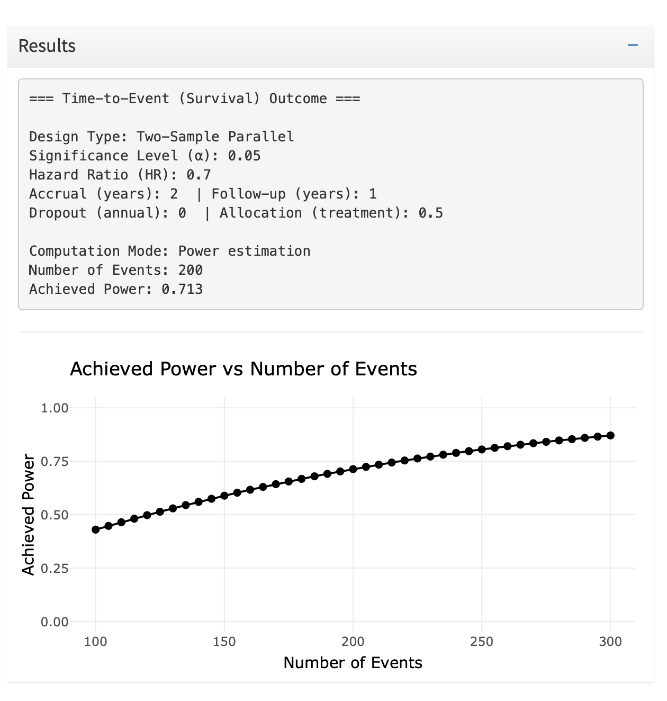
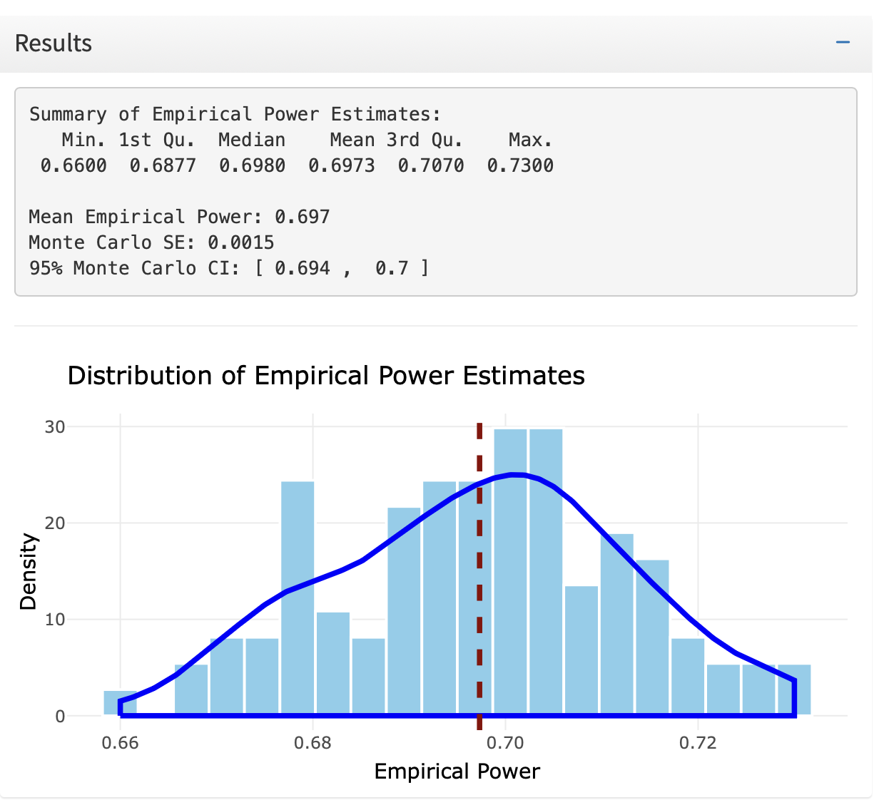

<h1 align="center">

Sample Size & Power Computation Toolkit for Clinical Trials

</h1>

   

------------------------------------------------------------------------

## 🧭 Overview

**PSClinical** is an interactive **R Shiny application** for sample size & power computation in clinical trials.
It allows users to **simulate and visualize empirical power** across different study designs, supporting **continuous**, **binary**, and **survival** outcomes under **parallel**, **paired**, and **one-sample** configurations.

This toolkit helps **biostatisticians**, **data scientists**, and **clinical researchers**:

-   Explore how design parameters influence statistical power
-   Compare analytical vs. simulated power results
-   Understand complex **time-to-event (survival)** scenarios using **Weibull** or **Exponential** distributions

------------------------------------------------------------------------

## 🚀 Features

| Design Type | Sub-Designs | Key Inputs | Methods Used |
|----|----|----|----|
| Continuous | Parallel, Paired, One-Sample | Δ (mean difference), σ (standard deviation) | t-tests |
| Binary | Parallel, Paired, One-Sample | p₁, p₂ (probabilities) | proportion tests |
| Survival | — | HR, λ₀, accrual, follow-up, Weibull shape | Cox PH simulation |

------------------------------------------------------------------------

## 🧩 Simulation Model

### 🎯 Empirical Power

Empirical power is estimated via repeated Monte Carlo simulations:

<b><i>Empirical Power</i></b> = (<i># of simulations with p-value</i> &lt; <i>α</i>) / (<i>Total simulations</i>)

------------------------------------------------------------------------

### ⏳ Survival Simulations

-   **Exponential:** constant hazard rate over time
-   **Weibull:** flexible hazard, allowing increasing or decreasing risk depending on the shape parameter

You can specify: 
- Baseline hazard (λ₀)
- Hazard ratio (HR)
- Shape parameter (k) for Weibull
- Accrual and follow-up durations
- Dropout rate

------------------------------------------------------------------------

## 🖥️ User Interface

### 🔹 Inputs Panel

Users define:   
- Design type (Continuous / Binary / Survival)
- Sub-design (Parallel, Paired, One-Sample)
- Sample size, repetitions, significance level, and other parameters
- Distribution and shape for survival data

------------------------------------------------------------------------

### 🔹 Results Panel

Displays:

-   Analytical sample size or required events for survival
  

  
   
  <em>Power estimation for a survival outcome</em>

  

  

-   Empirical power estimates with Monte Carlo SEs and 95% CIs
-   Distribution plots of simulated power values

  
   
  <em>Power estimation for a parallel design continuous outcome</em>

